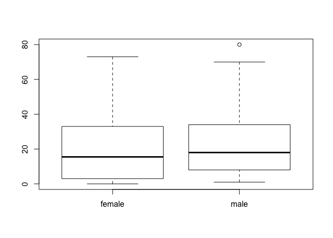

Daredevil's first day as a blind superhero
------------------------------------------

Do know a little of the back story of the Marvel Comic superhero Daredevil. It is the story of a man who loses his sight (funny enough, by trying to save a blind man) when a radioactive substance spills onto him. Although he loses his sight, his other senses become heightened and as a result he attains super human powers. This is a great analogy to someone beginning to switch from GUI based environments, like Excel, to a new programing environment, like R. Just like Daredevil’s first day as a superhero, after losing your “sight” you will touch, feel, and of course bump into things. Actually, many of the most basic of programming commands are just simple things you type to gain an understanding of your environment. Every object in R can be defined in countless ways that are not possible to understand from a simple visual representation offered by a visual based GUI. Daredevil lost his sight, but gained the power of echo location, achieving an insight into his surroundings not capable from sight alone. Eventually you stop grasping around you and begin to learn more advanced concepts and you will be able to just glide through to exactly where you want to be. Programming will allow you to stop spending endless amounts of time searching for the correct button for the tool you want to use, instead, you literally just tell the program what you want done. You can even make tools there aren’t even buttons for. Hell, you can make tools that the world has never seen. The question is will you use your super powers for good or evil?

Load Libraries
--------------

``` r
library(ggplot2)
```

Wrangle Data
------------

The [stereotypes.csv](http://cierareports.org/downloads/r_tutorial/stereotypes.csv) file contains data on 799 individuals from ages 18 to 26 who were were surveyed about their weekly their consumption habits. They were further categorized based on their clothing and music choices and put into four stereotypes: nerds, hipsters, metalheads, and hippies. Consumption of coffee (per cup), computer usage (hourly), showers, beers(per 12oz), and tacos. Oh yeah, this dataset is fake.

``` r
stereotypes <- read.csv("stereotypes.csv") 
metalheads <- subset(stereotypes, 
                     population == "metalhead")
metalheaddrinks <- subset(stereotypes, 
                          population == "metalhead", 
                          select = c(population, gender, coffee, beer))

metalheaddrinks <- cbind(metalheaddrinks, (metalheaddrinks$coffee + metalheaddrinks$beer))
names(metalheaddrinks)
```

    ## [1] "population"                                     
    ## [2] "gender"                                         
    ## [3] "coffee"                                         
    ## [4] "beer"                                           
    ## [5] "(metalheaddrinks$coffee + metalheaddrinks$beer)"

``` r
colnames(metalheaddrinks) <- c("population", "gender", "coffee", "beer", "sum")
names(metalheaddrinks)
```

    ## [1] "population" "gender"     "coffee"     "beer"       "sum"

``` r
summary(stereotypes)
```

    ##      population     gender        coffee         computer    
    ##  hippie   :200   female:400   Min.   : 0.00   Min.   : 0.00  
    ##  hipster  :199   male  :399   1st Qu.: 6.00   1st Qu.:12.00  
    ##  metalhead:200                Median :12.00   Median :24.00  
    ##  nerd     :200                Mean   :13.84   Mean   :28.65  
    ##                               3rd Qu.:22.00   3rd Qu.:43.00  
    ##                               Max.   :36.00   Max.   :95.00  
    ##      shower            beer           tacos            age       
    ##  Min.   : 0.000   Min.   : 0.00   Min.   : 0.00   Min.   :17.00  
    ##  1st Qu.: 4.000   1st Qu.: 6.00   1st Qu.:11.00   1st Qu.:20.00  
    ##  Median : 7.000   Median :17.00   Median :14.00   Median :22.00  
    ##  Mean   : 6.607   Mean   :21.13   Mean   :14.03   Mean   :22.34  
    ##  3rd Qu.: 9.000   3rd Qu.:33.00   3rd Qu.:17.00   3rd Qu.:24.00  
    ##  Max.   :18.000   Max.   :80.00   Max.   :42.00   Max.   :27.00

``` r
summary(metalheaddrinks)
```

    ##      population     gender        coffee           beer      
    ##  hippie   :  0   female:100   Min.   : 5.00   Min.   : 3.00  
    ##  hipster  :  0   male  :100   1st Qu.:12.00   1st Qu.:25.00  
    ##  metalhead:200                Median :16.00   Median :37.00  
    ##  nerd     :  0                Mean   :16.06   Mean   :36.73  
    ##                               3rd Qu.:20.00   3rd Qu.:47.00  
    ##                               Max.   :30.00   Max.   :80.00  
    ##       sum       
    ##  Min.   :13.00  
    ##  1st Qu.:40.50  
    ##  Median :53.50  
    ##  Mean   :52.78  
    ##  3rd Qu.:63.25  
    ##  Max.   :98.00

Plot Data
---------

``` r
plot(stereotypes$coffee)
```


``` r
qplot(beer, tacos, data = stereotypes)
```


``` r
hist(stereotypes$beer)
```


``` r
boxplot(stereotypes$beer ~ stereotypes$gender)
```



``` r
boxplot(stereotypes$beer ~ stereotypes$population)
```


``` r
qplot(beer, tacos, data = stereotypes)
```


``` r
qplot(beer, data = stereotypes, geom = "density", alpha = I(0.5), fill = population)
```


``` r
qplot(tacos, data = metalheads, geom = "density", fill = gender)
```


``` r
qplot(tacos, data = metalheads, geom = "density", fill = gender)
```


``` r
ggplot(stereotypes, aes(beer, tacos, color = population, shape = gender)) + 
  geom_point()
```


``` r
ggplot(metalheaddrinks, aes(gender, sum)) + geom_boxplot()
```


``` r
ggplot(metalheaddrinks, aes(gender, sum)) + geom_boxplot()
```


``` r
p <- ggplot(stereotypes, aes(shower, beer))
p + stat_smooth(method = "lm") + geom_point()
```


Develop Hypotheses
------------------

From your exploration of the stereotypes data make three hypotheses about the data.

Is there a visual difference between the genders?

Analyze Data
------------

``` r
t.test(metalheaddrinks$sum ~ metalheaddrinks$gender)
```

    ## 
    ##  Welch Two Sample t-test
    ## 
    ## data:  metalheaddrinks$sum by metalheaddrinks$gender
    ## t = -6.0437, df = 198, p-value = 7.358e-09
    ## alternative hypothesis: true difference in means is not equal to 0
    ## 95 percent confidence interval:
    ##  -18.820137  -9.559863
    ## sample estimates:
    ## mean in group female   mean in group male 
    ##                45.69                59.88

``` r
cor.test(stereotypes$shower, stereotypes$beer)
```

    ## 
    ##  Pearson's product-moment correlation
    ## 
    ## data:  stereotypes$shower and stereotypes$beer
    ## t = -6.5421, df = 797, p-value = 1.084e-10
    ## alternative hypothesis: true correlation is not equal to 0
    ## 95 percent confidence interval:
    ##  -0.2905583 -0.1588803
    ## sample estimates:
    ##        cor 
    ## -0.2257502

``` r
anova2 <- aov(computer ~ gender + population + 
                gender * population, data = stereotypes)
lm2 <- lm(computer ~ gender + population + 
                gender * population, data = stereotypes)
anova(anova2)
```

    ## Analysis of Variance Table
    ## 
    ## Response: computer
    ##                    Df Sum Sq Mean Sq  F value    Pr(>F)    
    ## gender              1    988     988   17.792 2.749e-05 ***
    ## population          3 241993   80664 1452.093 < 2.2e-16 ***
    ## gender:population   3   2826     942   16.957 1.107e-10 ***
    ## Residuals         791  43940      56                       
    ## ---
    ## Signif. codes:  0 '***' 0.001 '**' 0.01 '*' 0.05 '.' 0.1 ' ' 1

``` r
anova(lm2)
```

    ## Analysis of Variance Table
    ## 
    ## Response: computer
    ##                    Df Sum Sq Mean Sq  F value    Pr(>F)    
    ## gender              1    988     988   17.792 2.749e-05 ***
    ## population          3 241993   80664 1452.093 < 2.2e-16 ***
    ## gender:population   3   2826     942   16.957 1.107e-10 ***
    ## Residuals         791  43940      56                       
    ## ---
    ## Signif. codes:  0 '***' 0.001 '**' 0.01 '*' 0.05 '.' 0.1 ' ' 1

Interpret data
--------------

What is the distribution of each of the drink columns (beer, coffee, and sum) by gender. How do they compare to one another?

Is there a significant difference in drinking habits between female and male in the nerd population?

Is there a significant difference in number of showers between nerds and metalheads?

Is there a significant difference in taco consumption between female nerds and female metalheads?

Evaluate the data and results in relation to your hypothesis.

Draw a conclusion
-----------------

At this point you would relate your anlaysis and intrepration to a broader context.

Acknowledgments
---------------

The creation of this Rmd file came out of preparations for the Jupyter Notebook Hackathon: Reproducible Science Curriculum <https://github.com/Reproducible-Science-Curriculum/RR-Jupyter-Hackathon-Jan-2016>. While researching the particpants, I stumbled up a few blog posts by Ciera C. Martinez, including this one about handling your data like a super hero [1] and this one with advice for graduate students [2]. Rayna M Harris created the Rmarkdown file. Ciera C. Martinez drafted the blog post and content for R tutorial, which can be accessed here: <http://cierareports.org/blog/2013/10/18/rCourse2013/index.html>

[1] <http://cierareports.org/blog/2013/10/18/rCourse2013/index.html>
[2] <http://cierareports.org/blog/2016/01/30/phdAdvice/index.html>
